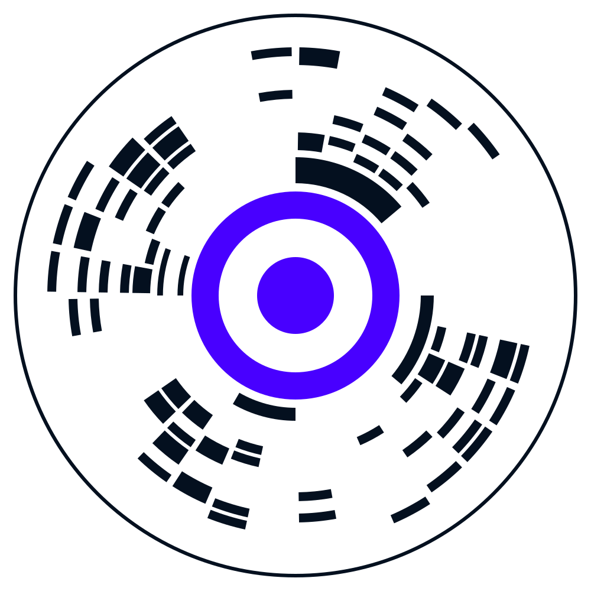

<p align="center">
  
</p>

# CYRQODE™

**Метка, по которой можно доказать, что было на самом деле.**

Один знак на предмете — и за ним вся история: из чего сделано, кем, на каком
оборудовании, по чьему допуску, с какими документами. Не «строка в базе», а
цепочка неизменяемых событий, каждое со ссылкой на свою причину.

**Статус: черновик v0.1.** Спецификация открыта для реализации, сервис в
разработке. Формат события ещё может измениться — см.
[«Что пока не зафиксировано»](#что-пока-не-зафиксировано).

---

## Попробуйте прямо сейчас

Откройте **[сканер](https://bizdnai.com/cyrqode/scan/)** на телефоне и наведите
его на эту метку прямо с экрана:

<p align="center">
  
</p>

Откроется [первая запись реестра](https://bizdnai.com/cyrqode/r/0199a3f7-8c21-7d4e-b6a9-2f5e8c1d4a70/) —
рождение технологии: имя, символ и спецификации, зафиксированные 6 сентября 2026
года вместе с отпечатками документов.

Второй пример — [паспорт партии молока](https://bizdnai.com/cyrqode/r/0199a410-3b72-7c81-9d5e-4a6f2b8c0e13/):
то, что увидит покупатель, отсканировав упаковку. Название, производитель,
жирность, состав, срок годности с отметкой свежести.

<p align="center">
  
</p>

Сканер работает в браузере телефона и **ничего не отправляет наружу** — кадры с
камеры остаются на устройстве.

> Версия 0.1: метку нужно навести в прицел, автоматический поиск в кадре появится
> позже. Если камера не открывается (частый случай внутри мессенджеров), сканер
> предложит открыть себя в браузере или распознать метку по снимку из файла.

---

## Зачем это нужно

Любая система учёта отвечает на вопрос «что записано». CYRQODE отвечает на
другой: **что произошло, в какой связи с остальным, по чьим полномочиям и можно
ли это доказать через год.**

**Производителю** — доказуемая история партии. Не «мы записали, что всё хорошо», а
проверяемая цепочка: из каких входных партий, на каком оборудовании, оператором с
действующим допуском, по какой ревизии техкарты, утверждённой такими-то людьми.
При споре с контрагентом или проверкой это разница между словом и доказательством.

**Покупателю** — один скан вместо доверия к этикетке. Что за продукт, кто сделал,
когда, что внутри. Без приложения, без регистрации, без слежки: сканер не
отправляет кадры наружу.

**Разработчику** — открытый протокол вместо чужого чёрного ящика. Формат,
канонизация, подпись, тестовые векторы и рабочий сканер лежат здесь. Свой
генератор, свой сканер, свой журнал — всё реализуемо без нашего участия.

**Интегратору** — идентичность, которая переживает носители. Метка отклеилась,
карту заменили, оборудование сменилось — идентификатор сущности прежний, история
не рвётся, замена фиксируется отдельным событием.

Ключевое отличие от блокчейн-решений: **никакого токена, никакой обязательной
распределённой сети.** Сервис работает сам по себе, а внешние свидетельства
подключаются позже, когда и если они нужны.

---

## С чего начать

| Хочу... | Читать |
|---|---|
| выпускать свои метки | **[Свой генератор](docs/generator.md)** |
| читать метки в своём приложении | **[Свой сканер](docs/scanner.md)** |
| проверить, что моя реализация совместима | **[Проверка совместимости](docs/verify.md)** |
| связать всё это с журналом событий | **[Подключение к журналу](docs/integrate.md)** |

Если пишете свой SDK, начните с одной команды — она сверит вашу канонизацию с
эталоном:

```bash
git clone https://github.com/Kabzhanov/cyrqode && cd cyrqode
python3 test-vectors/verify.py
```

Главное, что нужно понять до написания кода: **канонизация обязана совпадать
побайтово.** Событие сериализуется детерминированно, от результата берётся хэш,
хэш подписывается. Иначе сортируете ключи или иначе представляете числа — подпись
не сойдётся, и журнал отклонит событие. Тестовые векторы существуют именно для
этого.

---

## Из чего это состоит

### Открытый протокол и CyrQode Domain

Открытая часть CYRQODE описывает нейтральный протокол: идентификаторы, объекты,
отношения, события, доказательства и правила их канонизации и проверки. Она не
определяет, кому принадлежат данные и где работает конкретный журнал.

**CyrQode Domain** — закрытый суверенный цифровой контур субъекта, который
владеет или управляет им и определяет его политики раскрытия. Субъектом может
быть человек, компания, орган власти, городская администрация или государство.
В Domain находятся управляемые субъектом identities, objects, relationships,
authorities, events, evidence и access/disclosure policies; Domain может
содержать персональные и корпоративные данные. Объект сам по себе не владеет
Domain: станок, автомобиль, партия или документ могут перейти под управление
другого субъекта, при этом история событий сохраняется.

Наружу из закрытого Domain публикуются только разрешённые субъектом
представления — claims, proofs и public events (selective disclosure). Поэтому
открытый протокол совместим с разными реализациями, а закрытый Domain остаётся
контуром ответственности и контроля конкретного субъекта.

| Имя | Что означает |
|---|---|
| **CYRQODE™** | технология в целом, бренд, и сам физический знак |
| **BUIP** | протокол: модель данных, формат события, правила канонизации |
| **BizDNAi** | владелец технологии |

| Каталог | Содержимое |
|---|---|
| [`docs/`](docs/) | руководства: генератор, сканер, проверка, подключение |
| [`spec/`](spec/) | спецификация: модель данных, каноническое событие, канонизация |
| [`schemas/`](schemas/) | JSON Schema сущности, события и связи |
| [`test-vectors/`](test-vectors/) | векторы канонизации и подписи + `verify.py` |
| [`sdk/python/`](sdk/python/) | референсная реализация канонизации и подписи |
| [`tools/`](tools/) | генератор знака: кодирование, декодирование, рендер в SVG |
| [`web/scan/`](web/scan/) | рабочий сканер для браузера |
| [`examples/`](examples/) | примеры событий и готовых меток |

---

## Два принципа, определяющие всё остальное

**Первый: ядро отраслево-нейтрально.** Производство — первый и самый насыщенный
потребитель, но не предмет протокола. Производственные поля живут в отдельном
профиле, ядро о них не знает. Так же подключаются логистика, документооборот,
любая другая область.

**Второй: персональные данные в журнал не попадают.** Событие ссылается на
идентификатор сущности, а не на человека. Кто именно скрыт за идентификатором —
знает только владелец данных в своей системе. Технология при этом способна
доказать, что действие совершила сущность с нужным допуском в нужное время, — не
зная ни имени, ни должности.

Отсюда практическое правило: **носитель и сущность — разные вещи.** NFC-карта,
печатный знак, метка на оборудовании — это носители. Замена носителя не меняет
идентификатор и не рвёт историю, а сама замена фиксируется событием.

---

## Что уже закреплено

- **Подпись** — два профиля: `ed25519-sha256-v1` (основной) и
  `ecdsa-p256-sha256-v1` (смарт-карты, NFC secure element, HSM). Реализация,
  векторы и руководство: [`sdk/python/buip_signing.py`](sdk/python/buip_signing.py),
  [`test-vectors/signing.json`](test-vectors/signing.json),
  [`spec/signing.md`](spec/signing.md).
- **Идентификаторы** — UUIDv7 (RFC 9562), с возможностью UUIDv4 по политике
  тенанта там, где раскрывать момент создания нежелательно.
- **Канонизация** — RFC 8785 (JCS), с тестовыми векторами.

Обоснование решений: [ADR 0001](spec/adr/0001-crypto-and-identifiers.md). Менять
их после выпуска SDK нельзя — сторонние реализации перестанут сходиться.

**Версия 0.x — черновик:** схемы ещё могут меняться, в том числе ужесточаться.
Пишете свой SDK — привязывайтесь к конкретному коммиту, а не к «последней
версии». Правила совместимости, вступающие с 1.0:
[spec/versioning.md](spec/versioning.md).

## Что пока не зафиксировано

Честно о состоянии, чтобы никто не строил на песке:

- **Формат физического знака** — геометрия, ёмкость и коррекция ошибок в
  генераторе работают, но помечены как проектные. Финальные значения
  устанавливаются лабораторными испытаниями печати и считывания; до них обещать
  процент читаемости повреждённой метки было бы враньём.
- **Внешние свидетельства** и распределённая проверка — более поздний слой.
  Сейчас доказательность ограничена уровнями «подписано автором» и «принято
  авторитетным журналом».

---

## Границы и лицензии

Этот репозиторий — **открытая часть** технологии: протокол, схемы, SDK, генератор
знака и сканер. Серверная часть (журнал, резолвер, политики доступа) живёт
отдельно и распространяется на других условиях — см.
[BOUNDARIES.md](BOUNDARIES.md).

Записи в [`registry/`](registry/) — **демонстрационные**. Данные реальных клиентов
сюда не попадают: они живут в базе сервиса.

Спецификация и схемы — CC BY 4.0. Код SDK — Apache 2.0. Подробнее и о том, почему
именно так: [LICENSING.md](LICENSING.md).

CYRQODE™ — товарный знак BizDNAi, см. [TRADEMARK.md](TRADEMARK.md). Технически
совместимую реализацию можно делать и называть совместимой — как именно, написано
там же.
