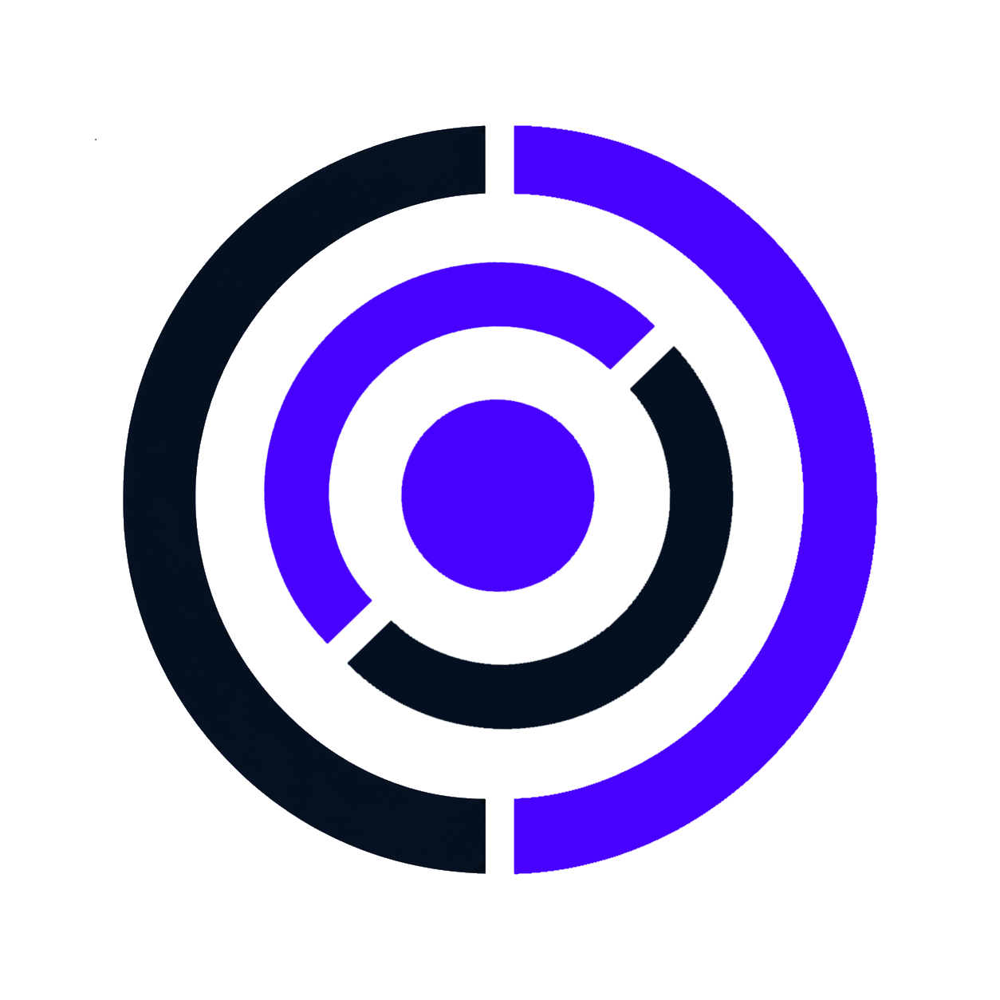
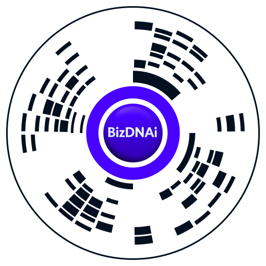

<p align="center">
  
</p>

# CYRQODE™

Технология доказуемой идентичности: универсальный идентификатор сущностей и
журнал событий и связей, которому можно верить.

| Имя | Что означает |
|---|---|
| **CYRQODE™** | технология в целом, бренд |
| **BUIP** | протокол: модель данных, формат события, правила канонизации |
| **Circle Mark (CM)** | физический знак — печатная марка или метка на предмете |
| **BizDNAi** | владелец технологии |

Этот репозиторий — открытая часть: спецификация протокола BUIP, схемы,
тестовые векторы, SDK и [рабочий сканер](https://bizdnai.com/cyrqode/scan/). Физический знак Circle Mark описывается отдельной
спецификацией, которая ещё готовится.

**Статус: черновик v0.1.** Спецификация открыта для реализации, сервис в
разработке. Формат события ещё может измениться — см. «Что не зафиксировано».

## Зачем это

Любая система учёта отвечает на вопрос «что записано». CYRQODE отвечает на
другой: **что произошло, в какой связи с остальным, по чьим полномочиям и можно
ли это доказать через год.**

Пример. Цех выпустил партию продукции. В учётной системе появится строка. CYRQODE
хранит другое: партия произведена из таких-то входных партий, на таком-то
оборудовании, оператором с действующим допуском, по такой-то ревизии
технологической карты, утверждённой такими-то людьми. Каждый факт — отдельное
неизменяемое событие со ссылками на причины.

Ключевое отличие от блокчейн-решений: **никакого токена, никакой обязательной
распределённой сети**. Сервис работает сам по себе, а внешние свидетельства
подключаются позже, когда и если они нужны.

## Попробуйте прямо сейчас

Откройте **[сканер](https://bizdnai.com/cyrqode/scan/)** на телефоне и наведите
его на эту метку с экрана:

<p align="center">
  
</p>

Откроется [первая запись реестра](https://bizdnai.com/cyrqode/r/0199a3f7-8c21-7d4e-b6a9-2f5e8c1d4a70/) —
рождение технологии: имя, символ и спецификации, зафиксированные 6 сентября
2026 года вместе с отпечатками документов.

Второй пример — [паспорт партии молока](https://bizdnai.com/cyrqode/r/0199a410-3b72-7c81-9d5e-4a6f2b8c0e13/):
то, что увидит покупатель, отсканировав упаковку. Название, производитель,
жирность, состав, срок годности с отметкой свежести.

Сканер работает в браузере телефона и **ничего не отправляет наружу** — кадры с
камеры остаются на устройстве. Если камера недоступна (частый случай внутри
мессенджеров), он предложит открыть себя в браузере или распознать метку по
снимку из файла.

Версия 0.1: метку нужно навести в прицел, автоматический поиск в кадре появится
позже.

## Что здесь есть

| Каталог | Содержимое |
|---|---|
| `spec/` | спецификация: модель данных, каноническое событие, канонизация |
| `schemas/` | JSON Schema сущности, события и связи |
| `test-vectors/` | тестовые векторы канонизации: пишете свой SDK — сверяйтесь с ними |
| `sdk/python/` | референсная реализация канонизации |
| `examples/` | примеры событий |

## Два принципа, определяющие всё остальное

**Первый: ядро отраслево-нейтрально.** Производство — первый и самый насыщенный
потребитель, но не предмет протокола. Производственные поля живут в отдельном
профиле, ядро о них не знает. Так же подключаются логистика, документооборот,
любая другая область.

**Второй: персональные данные в журнал не попадают.** Событие ссылается на
идентификатор сущности, а не на человека. Кто именно скрыт за идентификатором —
знает только сам владелец данных, в своей системе. Технология при этом способна
доказать, что действие совершила сущность с нужным допуском в нужное время, —
не зная ни имени, ни должности.

Из второго принципа следует практическое правило: **носитель и сущность —
разные вещи**. NFC-карта, печатный знак Circle Mark, метка на оборудовании — это носители.
Замена носителя не меняет идентификатор сущности и не рвёт её историю, а сама
замена фиксируется отдельным событием.

## Быстрый старт для тех, кто пишет свой SDK

```bash
git clone <репозиторий> && cd cyrqode
python3 test-vectors/verify.py    # сверить свою реализацию канонизации
```

Главное, что нужно понять до написания кода: **канонизация обязана совпадать
побайтово**. Событие сериализуется детерминированно, от результата берётся хэш,
хэш подписывается. Если ваша библиотека иначе сортирует ключи или иначе
представляет числа — подпись не сойдётся, и сервис отклонит событие. Тестовые
векторы в `test-vectors/` существуют именно для этого.

## Что не зафиксировано

Честно о состоянии, чтобы никто не строил на песке:

- **Алгоритм подписи выбран** (`spec/adr/0001-crypto-and-identifiers.md`):
  `ed25519-sha256-v1` (основной) и `ecdsa-p256-sha256-v1` (смарт-карты/HSM).
  Реализация, тестовые векторы и руководство — `sdk/python/buip_signing.py`,
  `test-vectors/signing.json`, `spec/signing.md`.
- **Способ генерации идентификаторов** обсуждается: требование — 128 бит,
  неизменяемость, отсутствие повторного использования.
- **Формат физической марки** (геометрия, ёмкость, коррекция ошибок) требует
  отдельной спецификации и лабораторных испытаний. До неё обещать процент
  читаемости повреждённой марки было бы враньём.
- **Внешние свидетельства** и распределённая проверка — более поздний слой.
  Сейчас доказательность ограничена уровнями «подписано автором» и «принято
  авторитетным журналом».

## Лицензии

Спецификация и схемы — CC BY 4.0. Код SDK — Apache 2.0. Подробнее и о том,
почему именно так: [LICENSING.md](LICENSING.md).

CYRQODE™ — товарный знак BizDNAi, см. [TRADEMARK.md](TRADEMARK.md).
